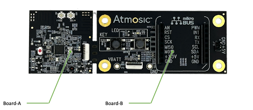

.. _atmbtcstag-iot-3405-applications:

ATMBTCSTAG-IOT-3405 Applications
################################

The complete PCBA of the ATMBTCSTAG-IOT-3405 reference design is shown below. It is a combined PCBA with two parts: Board A (left) and Board B (right). Board A is the main function board, and Board B is the IOT Expansion Board; they can be broken off from the vias at the edge of these two parts.

ATMBTCSTAG-IOT-3405 is a Bluetooth Channel Sounding Reflector (BTCS Reflector) tag reference design based on Atmosic ATM3405 Bluetooth LE SoC. It also includes an IoT expansion board that can be used for IoT application development.

The IoT Expansion Board (Board B) is designed to enhance the functionality of the ATM3405 Tag Reference Design by providing additional peripherals and expansion capabilities. When connected to Board A, it allows for the integration of various sensors and modules, making the ATM3405 Tag a versatile IoT development platform.

Product page URL: https://atmosic.com/products_kit_atmbtcstag-iot-3405/

Key features include:
 * Two Push Buttons (one connected to PWD and one connected to P5)
 * A yellow LED indicator (P7)
 * A mikroBUS™ socket for connecting a wide range of MIKROE CLICK boards
 * An FFC connector for firmware program and debug Interface

This expansion board provides developers with the flexibility to customize the ATM3405 Tag for unique applications by easily adding external sensors and peripherals.

Supported MIKROE CLICK Boards
*****************************

The mikroBUS™ socket on the IoT Expansion Board allows for easy integration of various MIKROE CLICK boards, expanding the functionality of the ATM3405 Tag Reference Design. This section lists some supported CLICK boards and provides basic information on their usage.

.. toctree::

   weather_click.rst
   usb_uart_click.rst
   ../../samples/shields/pir_click/README.rst
   ../../samples/shields/buzz_2_click/README.rst
