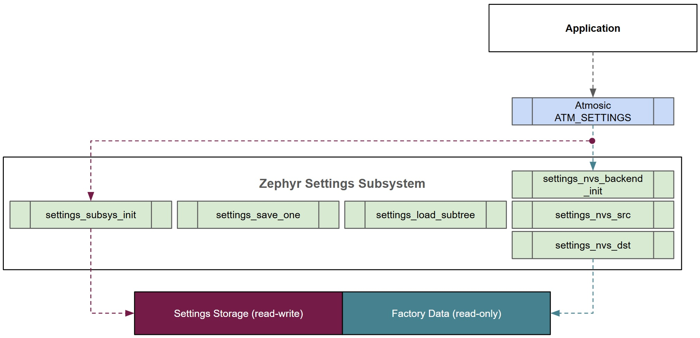
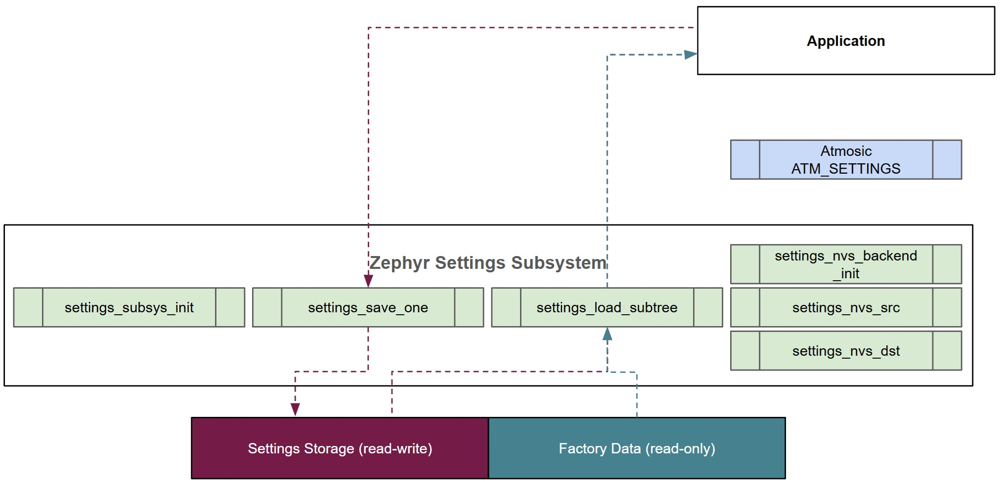

.. _atm_settings:

Atmosic Settings Subsystem (ATM_SETTINGS)
#########################################

The Atmosic Settings Subsystem (ATM_SETTINGS) integrates the Zephyr settings
subsystem to enhance flexibility and compatibility, and supports Factory data
and Settings storage for applications to use according to specifications or
requirements.

The ATM_SETTINGS includes several Zephyr settings configuration options and
invokes Zephyr's settings APIs. Therefore, when Zephyr settings subsystem is
upgraded, ATM_SETTINGS is also upgraded accordingly to stay in sync.

The main purpose of ATM_SETTINGS is to extend the initialization capabilities of
the Zephyr settings subsystem. The standard settings initialization in Zephyr
only supports the settings storage partition. With the ATM_SETTINGS, an
additional read-only factory data partition is also initialized.

.. raw:: html

     

However, access to these partitions is still performed through the standard
Zephyr settings APIs.

.. raw:: html

     

.. note::

    For detailed information about the Zephyr settings subsystem, please refer
    to the official Zephyr documentation at
    `Zephyr Settings Subsystem <https://docs.zephyrproject.org/latest/services/storage/settings/index.html>`_.

ATM_SETTINGS Configuration
***************************

The application uses the ATM_SETTINGS configuration to initialize the Zephyr
settings subsystem, allowing access to the settings storage and factory data
located in the flash partitions defined in the devicetree.

.. note::

    The files related to ATM_SETTINGS are located in the openair\\subsys\\settings directory.

The CONFIG_ATM_SETTINGS configuration is defined in Kconfig to enable the
ATM_SETTINGS feature. When enabled, it automatically selects required
configurations such as CONFIG_FLASH, CONFIG_FLASH_MAP, CONFIG_NVS, and
CONFIG_SETTINGS.

**File:** `openair\\subsys\\settings\\Kconfig`

.. code-block:: bash

    config ATM_SETTINGS
    	bool "Proprietary settings subsystem library"
    	select FLASH
    	select FLASH_MAP
    	select NVS
    	select SETTINGS

The CONFIG_ATM_SETTINGS configuration option adds the atm_settings include
directory and atm_settings source code to Zephyr's build system.

Configuring the CONFIG_ATM_SETTINGS option in the project configuration file
will activate the Zephyr settings subsystem and the related ATM_SETTINGS
functions.

ATM_SETTINGS only supports the SETTINGS_NVS backend. ATM_SETTINGS will only
access data when used in conjunction with the SETTINGS_NVS backend, and will
treat all other backends as equivalent to SETTINGS_NONE.

**File:** `prj.conf`

.. code-block:: bash

    CONFIG_ATM_SETTINGS=y

ATM_SETTINGS Initialization
***************************

The ATM_SETTINGS provides several functions, which are described below. However,
users only need to focus on the ``atm_settings_init()`` function for
initializing ATM_SETTINGS. The ATM_SETTINGS initialization is designed to mount
and start up the settings storage and factory data within the Zephyr settings
subsystem.

- ``atm_settings_init()`` initializes the settings subsystem based on the settings storage partition and factory data partition defined in the device tree.
- ``atm_settings_subsys_init()`` provides proprietary settings subsystem initialization that allows for more flexibility in configuring the settings subsystem instead of settings storage partition only.
- ``atm_settings_factory_partition_info_get()`` gets the factory partition information defined in the device tree.
- ``atm_get_device_partition_info()`` gets the specified partition information defined in the device tree based on the partition ID.
- ``atm_settings_backend_init()`` initializes the settings subsystem backends based on the specified settings configuration information instead of settings storage partition.

ATM_SETTINGS Factory Data Write Protection
******************************************

To prevent the factory data from being unexpectedly modified, it is set to
read-only during ATM_SETTINGS initialization. Additionally, hardware-level write
protection is applied during system startup.

ATM_SETTINGS Sample
*******************

The :ref:`ATM_SETTINGS sample <atm_settings-sample>` demonstrates how to use the
ATM_SETTINGS and the Zephyr settings subsystem related functions to access
factory data and settings storage. Some of the Zephyr APIs used in the
ATM_SETTINGS sample are shown below.

- `settings_save_one() <https://docs.zephyrproject.org/latest/doxygen/html/group__settings.html#gaf22356f0dd01d4cf43a6297fafa86e30>`_
- `settings_load() <https://docs.zephyrproject.org/latest/doxygen/html/group__settings.html#ga89c6d618df81f197cc5c1a2018b00648>`_
- `settings_load_subtree() <https://docs.zephyrproject.org/latest/doxygen/html/group__settings.html#gab80e8a21c80243359b652386f7ce2424>`_
